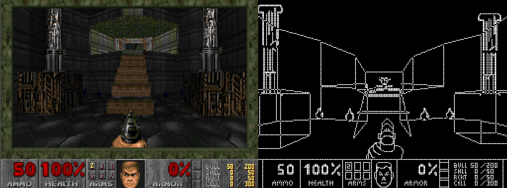

### Quandoom

It is a well-known fact that all useful computational devices that have ever been created are capable of running DOOM. Despite decades of active research, there is yet to be developed a single practical use for quantum computers. This changes today, with the release of Quandoom, a port of DOOM designed for a quantum computer, given as a single QASM file, using a mere 75,000 qubits and 60 million gates.

Although such a quantum computer doesn't exist right now (and probably won't for a while), this algorithm is efficiently simulatable on a classical computer, capable of running at 10-20 fps on a laptop using the accompanying lightweight (150 lines of C++) and parallelized QASM simulator.

The game loop is as follows:
1) the user pressing a key sets the state of one of the input qubits
2) the QASM file containing all the quantum gates is applied to the state
3) the last 64000 qubits are measured and displayed as a 320 x 200 grid of binary pixels
4) screen qubits are reset and the process repeats

What advantages does Quandoom have over the original DOOM? Basically none, it's mostly just for fun, although due to the Hadamards it would mean playing it on a quantum device would make the random chances **truly** random. It might also use less energy at a theoretical level, due to the reversible nature of everything apart from the screen measurement.

### Screenshot



### How To Play It

First, download the latest release HERE. Then, extract the zip and run the quantum circuit (quandoom.qasm) with the simulator provided, by dragging it onto simulator.exe (Windows) or via running ./simulator.bin quandoom.qasm (Linux).

### Changes versus the original

Alright, so after like a year of working on this I got bored, so it doesn't have all the features from the original DOOM. More specifically:

- everything is x-ray due to the fact we can't read the screen during processing
- no color because it'd make rendering a lot harder and the x-ray would look weirder
- no music or sound because copyright and I'm not a composer
- it's only the first level, more could be added, it's just a matter of mapping them
- no level secrets, although again it's just a matter of mapping
- enemies can't travel between rooms
- no automap, because eh
- imp fireball is hitscan rather than a projectile
- minor tweaks regarding armor/health/damage

### Technical details

If you want to compile the simulator yourself, you can do so as follows:
```bash
sudo apt-get install g++ make libsdl2-dev -y
git clone https://github.com/lumorti/Quandoom
cd Quandoom
make
```

Please note that the simulator is tailor-made for the this QASM file, it will not work on a general QASM file. The Quandoom QASM file is also not completely compliant, as described in a comment at the top of the file, some qubit lists are abbreviated as "ALLQUBITS" because if I didn't do that then it would be a >30GB file.

For now I'm still tidying up the engine code, but basically I have about 8000 lines of c++ functions allowing a number of reversible binary and arithmetic operations on quantum registers, for example "flipIfLessThanOrEqualTo(regToFlip, regToCheck, valueToCheck)" which flips all qubits in a register if the decimal value of another register is less than some given value. Everything is done with integers. Using such functions I then wrote a small 3D engine as well as all the game logic. Also present is an ancilla system, a garbage system, as well as a quantum subroutine system and many other handy tools. Mapping was done by hand. Sprite scaling and ray casting are baked-in (i.e. pre-calculated). Parallelisation is done at the rendering stage, such that the list of render objects is split between cores and comments are left in the QASM to tell the simulator where to jump based on OpenMP thread ID. 

Maybe soon I'll make a little document and put it on the arXiv if there's interest. Or, if you want the code to expand it, let me know and I'll rush the tidying up.

### Legal Disclaimer

This is a recreation of the first level of the original DOOM game, which was released as shareware by Id Software in 1997. This project is released as a non-commercial open-source project made in good faith in relation to the "anything can run DOOM" internet meme, for which a vast number of fan-made ports to various devices already exist. This project does not serve as a replacement for the original DOOM, acting purely as a technical demonstration / parody, a fact which is obvious to anyone using it. DOOM, its characters, assets and level design are the intellectual property of Id Software. The author of this work advises anyone who actually wants to play the game to download the official shareware version. 
